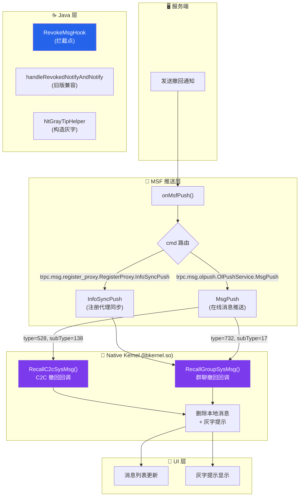

# 修改QQ实现纯防撤回（不显示灰字）完整指南

> 基于 QAuxiliary 源码逆向分析 — 从 NT Kernel 到 Java 层的多层拦截方案
>
> **版本：** 2024-07 ｜ **适用：** QQ NT 9.x ｜ **难度：** 中高级

---

## 📖 目录

1. [需求分析：防撤回但不显示灰字](#1-需求分析防撤回但不显示灰字)
2. [QQ 撤回消息的完整链路](#2-qq-撤回消息的完整链路)
3. [方案一：Native Kernel 层拦截（推荐）](#3-方案一native-kernel-层拦截推荐)
4. [方案二：Java MSF Push 层拦截](#4-方案二java-msf-push-层拦截)
5. [方案三：Smali Patch（APK 直接修改）](#5-方案三smali-patchapk-直接修改)
6. [方案四：旧版协议兼容处理](#6-方案四旧版协议兼容处理)
7. [方案对比与选择建议](#7-方案对比与选择建议)
8. [验证与测试](#8-验证与测试)
9. [注意事项与风险](#9-注意事项与风险)

---

## 1. 需求分析：防撤回但不显示灰字

QAuxiliary 的防撤回功能在拦截撤回消息后，会**构造一条自定义灰字提示（Gray Tip）**插入聊天界面，告知用户"XX尝试撤回了一条消息"。这虽然保留了信息，但**灰字本身也是一种"提示"**，在群聊中若多人同时撤回，聊天界面会充满大量灰字提示，影响体验。

本指南的目标是：**修改 QQ 自身**（而非通过 Xposed 模块），在服务端撤回通知到达时直接丢弃，**既不删除本地消息，也不产生任何灰字提示**，让撤回操作对用户完全"透明"。

> 💡 **核心思路：** 在撤回通知到达 QQ 客户端的消息处理链路中，找到最上游的拦截点，直接丢弃撤回事件，使后续的"删除消息"和"显示灰字"逻辑都不会触发。

---

## 2. QQ 撤回消息的完整链路

在动手修改之前，必须理解 QQ NT 内核中撤回消息的完整数据流。以下流程图基于 QAuxiliary 源码分析绘制：



> **图1：** QQ NT 撤回消息的完整数据流（拦截点已在图中高亮标注）

### 关键拦截点分析

| 层级 | 函数/方法 | 作用 | 拦截效果 |
|---|---|---|---|
| **Native** | `RecallC2cSysMsg` | libkernel.so 中处理 C2C 撤回的 C++ 函数 | ✅ 最彻底：消息不删除、灰字不产生 |
| **Native** | `RecallGroupSysMsg` | libkernel.so 中处理群聊撤回的 C++ 函数 | ✅ 最彻底：消息不删除、灰字不产生 |
| **Java** | `onMsfPush` | MSF 推送入口，拦截 Protobuf 数据 | ⚠️ 需解析 Protobuf 判断类型 |
| **Java** | `handleRevokedNotifyAndNotify` | 旧版 QQ 撤回处理入口 | ⚠️ 仅适用旧版协议 |
| **Java** | `GuildEventFlowServiceImpl.handleDeleteEvent` | 频道消息撤回 | ⚠️ 仅适用频道 |

---

## 3. 方案一：Native Kernel 层拦截（推荐）

这是**最干净、最可靠**的方案。在 `libkernel.so` 中直接 patch `RecallC2cSysMsg` 和 `RecallGroupSysMsg` 两个函数，使其在入口处直接返回，不执行任何撤回逻辑。

### 3.1 定位目标函数

这两个函数在 `libkernel.so` 中没有导出符号，需要通过 **AOB（Array of Bytes）特征码扫描** 来定位。QAuxiliary 的 Native 层代码（`NtRecallMsgHook.cc`）提供了精确的特征码：

#### RecallC2cSysMsg 特征码

```
AOB:  09 8d 40 f8 ?? 03 00 aa 21 00 80 52 f3 03 02 aa 29 ?? 40 f9
Mask: ff ff ff ff 00 ff ff ff ff ff ff ff ff ff ff ff ff 00 ff ff
Offset: 函数入口 = 扫描结果 - 0x20
```

#### RecallGroupSysMsg 特征码（QQ ≥ 9.2.20）

```
AOB:  09 8d 40 f8 29 95 40 f9 ?? ?? 00 94 ?? 04 00 36 ?? 02 40 f9 61 00 80 52
Mask: ff ff ff ff ff ff ff ff 00 00 ff ff 00 ff ff ff 00 ff ff ff ff ff ff ff
Offset: 函数入口 = 扫描结果 - 0x44
```

#### RecallGroupSysMsg 特征码（QQ < 9.2.20）

```
AOB:  28 00 40 f9 61 00 80 52 09 8d 40 f8 29 ?? 40 f9
Mask: ff ff ff ff ff ff ff ff ff ff ff ff ff 00 ff ff
Offset: 函数入口 = 扫描结果 - 0x18
```

> ⚠️ **注意：** 特征码会随 QQ 版本更新而变化。每次 QQ 更新后需要重新验证特征码是否仍然有效。如果扫描失败，需要从新版 libkernel.so 中反汇编重新提取。

### 3.2 两种 Patch 方式

#### 方式 A：ARM64 指令 Patch（静态修改 libkernel.so）

在函数入口处写入 ARM64 `RET` 指令（`0xD65F03C0`），使函数直接返回：

```cpp
// ARM64 RET 指令编码: 0xD65F03C0
// 函数入口地址 = libkernel.so 基址 + 函数偏移

// C2C 撤回函数: 在入口偏移处写入 RET
*(uint32_t*)(base + offsetC2c) = 0xD65F03C0;

// 群聊撤回函数: 在入口偏移处写入 RET
*(uint32_t*)(base + offsetGroup) = 0xD65F03C0;
```

完整实现（参考 QAuxiliary 的 `NtRecallMsgHook.cc`）：

```cpp
#include <cstdint>
#include <sys/mman.h>
#include <unistd.h>

// 修改内存页为可写
static bool patch_ret(void* addr) {
    uintptr_t page_start = (uintptr_t)addr & ~(getpagesize() - 1);
    size_t page_size = getpagesize();
    
    if (mprotect((void*)page_start, page_size, 
                  PROT_READ | PROT_WRITE | PROT_EXEC) != 0) {
        return false;
    }
    
    // 写入 RET 指令
    *(uint32_t*)addr = 0xD65F03C0;
    
    // 刷新指令缓存（ARM64 必需）
    __builtin___clear_cache((char*)page_start, 
                            (char*)page_start + page_size);
    return true;
}

// 在 libkernel.so 加载后执行
bool PerformAntiRecallPatch(uint64_t baseAddress) {
    // 1. 扫描特征码定位函数
    uint64_t offsetC2c = AobScanForRecallC2cSysMsg(baseAddress);
    uint64_t offsetGroup = AobScanForRecallGroupSysMsg(baseAddress);
    
    // 2. Patch 为 RET
    if (offsetC2c != 0) {
        patch_ret((void*)(baseAddress + offsetC2c));
    }
    if (offsetGroup != 0) {
        patch_ret((void*)(baseAddress + offsetGroup));
    }
    return true;
}
```

#### 方式 B：Inline Hook（运行时动态 Hook）

使用 Dobby 或其他 inline hook 框架，将目标函数替换为空实现：

```cpp
// 空实现：直接返回，不做任何事
void EmptyRecallCallback(void* x0, void* x1, void* x2) {
    // 什么都不做，直接返回
    return;
}

// 安装 Hook
void* originC2c = nullptr;
void* originGroup = nullptr;

DobbyHook((void*)(base + offsetC2c), 
          (void*)EmptyRecallCallback, 
          (void**)&originC2c);
DobbyHook((void*)(base + offsetGroup), 
          (void*)EmptyRecallCallback, 
          (void**)&originGroup);
```

> ℹ️ **方式 A vs 方式 B：** 方式 A 直接修改 so 文件，适合做二次打包分发的修改版 QQ。方式 B 运行时注入，适合配合 Xposed/Frida 等框架使用。对于"修改 QQ 本身"的需求，推荐方式 A。

### 3.3 完整修改流程

1. 从 APK 中提取 `lib/arm64-v8a/libkernel.so`
2. 用 IDA Pro / Ghidra 反汇编，通过特征码定位 `RecallC2cSysMsg` 和 `RecallGroupSysMsg`
3. 在函数入口偏移处将第一条指令改为 `RET`（`0xD65F03C0`，4 字节小端序）
4. 保存修改后的 `libkernel.so`
5. 重新打包 APK 并签名

> ✅ **效果：** 此方案修改后，无论 C2C 还是群聊的撤回通知到达 Native Kernel 层时，处理函数直接返回，**消息不会被删除，也不会产生任何灰字提示**。用户体验：对方撤回消息后，消息仍然完整保留在聊天记录中，就像什么都没发生一样。

---

## 4. 方案二：Java MSF Push 层拦截

如果不方便修改 Native 层，可以在 Java 层拦截 MSF 推送。根据 QAuxiliary 源码分析，所有撤回通知都通过 `IQQNTWrapperSession$CppProxy.onMsfPush()` 方法进入 Java 层。

### 4.1 拦截点：onMsfPush

在 `com.tencent.qqnt.kernel.nativeinterface.IQQNTWrapperSession$CppProxy` 的 `onMsfPush` 方法中，根据 `cmd` 参数判断是否为撤回相关推送：

```java
// 关键命令字
// C2C 撤回: "trpc.msg.olpush.OlPushService.MsgPush" + type=528/subType=138
// 群聊撤回: "trpc.msg.olpush.OlPushService.MsgPush" + type=732/subType=17
// 群聊撤回(同步): "trpc.msg.register_proxy.RegisterProxy.InfoSyncPush"

public void onMsfPush(String cmd, byte[] protoBuf, PushExtraInfo extraInfo) {
    // 拦截撤回命令
    if (isRecallCommand(cmd, protoBuf)) {
        return; // 直接丢弃，不调用原始逻辑
    }
    // 非撤回消息，走原始逻辑
    originalOnMsfPush(cmd, protoBuf, extraInfo);
}
```

### 4.2 判断是否为撤回消息

需要解析 Protobuf 数据来判断。根据 QAuxiliary 的 Protobuf 定义：

```java
// 判断 MsgPush 中的撤回类型
MsgPushOuterClass.MsgPush msgPush = MsgPushOuterClass.MsgPush.parseFrom(protoBuf);
if (msgPush.hasMessage()) {
    MessageOuterClass.Message message = msgPush.getMessage();
    if (message.hasContentHead()) {
        ContentHeadOuterClass.ContentHead head = message.getContentHead();
        int type = head.getType();
        int subType = head.getSubType();
        // C2C 撤回: type=528, subType=138
        // 群聊撤回: type=732, subType=17
        if ((type == 528 && subType == 138) || 
            (type == 732 && subType == 17)) {
            return true; // 是撤回消息，需要拦截
        }
    }
}

// 判断 InfoSyncPush 中的撤回
if ("trpc.msg.register_proxy.RegisterProxy.InfoSyncPush".equals(cmd)) {
    InfoSyncPushOuterClass.InfoSyncPush push = 
        InfoSyncPushOuterClass.InfoSyncPush.parseFrom(protoBuf);
    if (push.hasSyncMsgRecall()) {
        return true; // 包含群聊撤回同步数据
    }
}
```

### 4.3 Smali 修改指南

如果通过 Smali 修改 APK，需要定位到 `IQQNTWrapperSession$CppProxy` 的 `onMsfPush` 方法，在方法开头插入判断逻辑：

```smali
.method public onMsfPush(Ljava/lang/String;[BLcom/tencent/qqnt/kernel/nativeinterface/PushExtraInfo;)V
    .registers 8

    # === 新增：拦截撤回命令 ===
    # 检查 cmd 是否为撤回相关
    # 如果是，直接 return-void
    invoke-static {p1, p2}, Lcom/example/AntiRecallHelper;->isRecallCommand(Ljava/lang/String;[B)Z
    move-result v0
    if-eqz v0, :cond_continue
    return-void
    :cond_continue
    # === 原始逻辑继续 ===
    ...
```

> ⚠️ **局限性：** 此方案需要解析 Protobuf 数据，依赖 Protobuf 库。如果通过 Smali 实现，需要额外引入 Protobuf 依赖或手动解析二进制格式。另外，这个拦截点比 Native 层更靠后，无法阻止某些在 Native 层已执行的预处理逻辑。

---

## 5. 方案三：Smali Patch（APK 直接修改）

对于没有 NDK 开发环境的场景，可以直接修改 APK 中的 Smali 代码。以下是针对不同场景的具体修改点：

### 5.1 修改旧版撤回处理

- **目标类：** `com.tencent.mobileqq.msg.api.impl.MessageFacadeImpl`
- **目标方法：** `handleRevokedNotifyAndNotify`

修改方式：在方法开头直接 `return-void`：

```smali
.method public handleRevokedNotifyAndNotify(Ljava/util/ArrayList;Z)V
    .registers 3
    # Patch: 直接返回，不处理任何撤回
    return-void
.end method
```

### 5.2 修改频道撤回

- **目标类：** `com.tencent.mobileqq.guild.message.eventflow.api.impl.GuildEventFlowServiceImpl`
- **目标方法：** `handleDeleteEvent`

修改方式：在方法开头直接 `return-void`：

```smali
.method public handleDeleteEvent(...)V
    .registers 5
    # Patch: 直接返回，不处理频道消息删除
    return-void
.end method
```

### 5.3 修改 NT 内核撤回

- **目标类：** `com.tencent.qqnt.kernel.nativeinterface.IQQNTWrapperSession$CppProxy`
- **目标方法：** `onMsfPush`

修改方式：在方法开头拦截特定 cmd：

```smali
.method public onMsfPush(Ljava/lang/String;[B ...)V
    .registers 6

    # 检查 cmd 是否为 InfosyncPush 或 MsgPush
    iget-object v0, p0, ... # 获取 cmd
    const-string v1, "trpc.msg.olpush.OlPushService.MsgPush"
    invoke-virtual {v0, v1}, Ljava/lang/String;->equals(Ljava/lang/Object;)Z
    move-result v1
    if-eqz v1, :cond_return

    const-string v1, "trpc.msg.register_proxy.RegisterProxy.InfoSyncPush"
    invoke-virtual {v0, v1}, Ljava/lang/String;->equals(Ljava/lang/Object;)Z
    move-result v1
    if-eqz v1, :cond_return

    # 非撤回推送，继续执行
    goto :cond_original

    :cond_return
    return-void

    :cond_original
    # 原始逻辑
    ...
```

> ⚠️ **注意：** 这种简单粗暴的拦截方式会阻止 **所有** MsgPush 和 InfoSyncPush 推送，而不仅仅是撤回消息。这会导致其他通过相同命令字推送的消息（如系统通知、状态同步等）也被拦截。建议只在 Native 层方案不可行时作为临时方案使用。

---

## 6. 方案四：旧版协议兼容处理

对于还在使用旧版 QQ 协议（非 NT 内核）的场景，撤回消息通过 `MessageFacadeImpl.handleRevokedNotifyAndNotify` 处理。QAuxiliary 中对应的代码在 `RevokeMsgHook.java` 的 `initOnce()` 方法中（第 214-253 行）。

### 6.1 拦截点

```java
// 方法签名
void handleRevokedNotifyAndNotify(ArrayList<RevokeMsgInfo> list, boolean flag)

// RevokeMsgInfo 字段（Parcelable 序列化）：
//   istroop:  int     - 0=C2C, 1=群聊
//   shmsgseq: long    - 消息序列号
//   friendUin: String - 对方/群号
//   msgUid:   long    - 消息UID
//   fromUin:  String  - 撤回者UIN
//   time:     long    - 撤回时间
//   authorUin: String - 原始消息作者UIN（群聊时有效）
//   opType:   int     - 0=自撤回, 1=管理员撤回
```

### 6.2 Smali 修改

最简单的方法：直接让 `handleRevokedNotifyAndNotify` 变成空方法：

```smali
# 文件: smali_classesX/com/tencent/mobileqq/msg/api/impl/MessageFacadeImpl.smali

.method public handleRevokedNotifyAndNotify(Ljava/util/ArrayList;Z)V
    .locals 0
    return-void
.end method
```

如果需要**保留自己撤回消息的灰字**（仅拦截他人撤回），则需要更精细的判断：

```smali
.method public handleRevokedNotifyAndNotify(Ljava/util/ArrayList;Z)V
    .registers 8

    # 遍历撤回列表，过滤掉非自己的撤回
    invoke-virtual {p1}, Ljava/util/ArrayList;->iterator()Ljava/util/Iterator;
    move-result-object v0
    :loop_start
    invoke-interface {v0}, Ljava/util/Iterator;->hasNext()Z
    move-result v1
    if-eqz v1, :loop_end

    invoke-interface {v0}, Ljava/util/Iterator;->next()Ljava/lang/Object;
    move-result-object v2

    # 获取 fromUin 字段
    # 与当前用户 UIN 比较
    # 如果不是自己撤回的，从列表中移除
    # (详细实现略)

    goto :loop_start
    :loop_end

    # 如果列表为空，直接返回
    invoke-virtual {p1}, Ljava/util/ArrayList;->isEmpty()Z
    move-result v1
    if-eqz v1, :cond_return
    return-void
    :cond_return

    # 继续原始逻辑（仅处理自己撤回的消息）
    invoke-special {p0, p1, p2}, ...;->handleRevokedNotifyAndNotify(...)V
    return-void
.end method
```

---

## 7. 方案对比与选择建议

| 方案 | 修改层级 | 覆盖范围 | 实现难度 | 可靠性 | 推荐场景 |
|---|---|---|---|---|---|
| **方案一** | Native (libkernel.so) | C2C + 群聊 | ⭐⭐⭐⭐ | ⭐⭐⭐⭐⭐ | 二次打包分发、长期维护 |
| **方案二** | Java (onMsfPush) | C2C + 群聊 | ⭐⭐⭐ | ⭐⭐⭐⭐ | Xposed 模块、Frida 脚本 |
| **方案三** | Smali (APK) | 部分覆盖 | ⭐⭐ | ⭐⭐⭐ | 快速验证、简单修改 |
| **方案四** | Java (旧版) | 旧版协议 | ⭐ | ⭐⭐ | 兼容旧版 QQ |

> ✅ **推荐组合：方案一（Native Patch）+ 方案四（旧版兼容）**。这样既能覆盖 NT 内核的 C2C 和群聊撤回，也能兼容旧版协议。对于频道（Guild）撤回，需要额外处理 `GuildEventFlowServiceImpl.handleDeleteEvent`。

---

## 8. 验证与测试

### 8.1 测试场景清单

| 场景 | 预期行为 | 验证方法 |
|---|---|---|
| C2C 对方撤回文字 | 消息保留，无灰字 | 用另一个号发消息后撤回 |
| C2C 对方撤回图片 | 图片保留，无灰字 | 用另一个号发图片后撤回 |
| C2C 自己撤回消息 | 消息保留，无灰字 | 自己发送后撤回 |
| 群聊成员撤回 | 消息保留，无灰字 | 群内成员发消息后撤回 |
| 群聊管理员撤回他人 | 消息保留，无灰字 | 管理员撤回他人消息 |
| 频道消息撤回 | 消息保留，无灰字 | 频道内撤回消息 |
| 登录同步撤回 | 消息保留，无灰字 | 离线期间有撤回，重新登录 |
| 连续多条撤回 | 全部保留，无灰字 | 对方连续撤回多条消息 |

### 8.2 调试技巧

```bash
# 使用 logcat 过滤撤回相关日志
adb logcat | grep -iE "recall|revoke|RecallSysMsg|handleRevoked"

# 使用 Frida 动态验证 Hook 点
frida -U -n com.tencent.mobileqq -l verify_hook.js
```

```javascript
// verify_hook.js 示例
var libkernel = Process.getModuleByName("libkernel.so");
// 扫描特征码确认函数存在
Memory.scan(libkernel.base, libkernel.size, 
    "09 8d 40 f8 ?? 03 00 aa 21 00 80 52", {
    onMatch(address, size) {
        console.log("RecallC2cSysMsg found at:", address.sub(libkernel.base));
    }
});
```

---

## 9. 注意事项与风险

> ⚠️ **版本兼容性：** QQ 每次更新都可能改变 `libkernel.so` 的内部函数偏移和特征码。需要建立自动化验证流程，在每次 QQ 更新后重新确认特征码有效性。

> ⚠️ **签名校验：** 修改后的 APK 需要重新签名，QQ 可能有签名校验机制。如果存在签名校验，需要额外 patch 签名校验逻辑。

> ⚠️ **封号风险：** 修改 QQ 客户端违反腾讯的用户协议，可能导致账号被封禁。本指南仅供技术研究使用。

> ℹ️ **多进程架构：** QQ NT 使用多进程架构（主进程 + MSF 进程）。Native 层的 patch 会影响所有加载了 libkernel.so 的进程。如果只在主进程 patch，MSF 进程中的撤回消息可能仍然会触发处理。

### 关键源码文件索引（QAuxiliary）

| 文件 | 作用 |
|---|---|
| `app/src/main/java/cc/ioctl/hook/msg/RevokeMsgHook.java` | 防撤回主逻辑（Java 层 Hook） |
| `app/src/main/cpp/ntkernel/NtRecallMsgHook.cc` | Native 层 Hook（特征码扫描 + Inline Hook） |
| `app/src/main/java/cc/ioctl/hook/guild/RevokeGuildMsg.kt` | 频道防撤回 |
| `app/src/main/java/io/github/qauxv/bridge/ntapi/NtGrayTipHelper.java` | 灰字提示构造（本方案中不需要） |
| `app/src/main/java/io/github/qauxv/bridge/RevokeMsgInfoImpl.java` | 旧版撤回信息解析 |
| `app/src/main/java/io/github/qauxv/bridge/kernelcompat/KernelMsgServiceCompat.java` | Kernel 消息服务兼容层 |
| `app/src/main/proto/trpc/msg/recall/C2CMsgRecall.proto` | C2C 撤回 Protobuf 定义 |
| `app/src/main/proto/trpc/msg/recall/GroupMsgRecall.proto` | 群聊撤回 Protobuf 定义 |
| `app/src/main/proto/trpc/msg/InfoSyncPush.proto` | InfoSync 推送 Protobuf 定义 |
| `app/src/main/java/cc/ioctl/fragment/RevokeMsgConfigFragment.kt` | 设置界面（本方案中不需要） |

---

本指南基于 QAuxiliary 项目源码（`cc.ioctl.hook.msg.RevokeMsgHook` 及相关文件）的完整逆向分析编写。核心修改思路是：**在撤回通知的最上游（Native libkernel.so）直接丢弃，使下游所有逻辑（消息删除、灰字提示）都不会触发**，从而实现"纯防撤回，无灰字"的效果。

> 基于 QAuxiliary 开源项目源码分析 · 仅供技术研究参考
